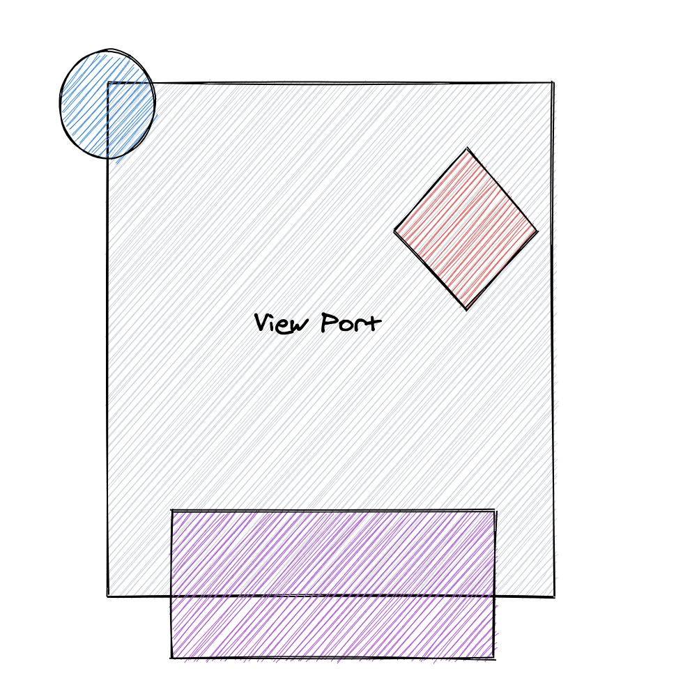

# use-intersection-observer 🚦🚦

### An intersection observer hook for all your purposes</h3>

<p align="center">
    
    
    
  </p>

<p align="center"></p>

#### ✅ Built on new flashy Reactjs hooks.

#### ✅ No assumption on the elements you want to observe.

#### ✅ Completely configurable.

### Installing

If using npm:

```sh

npm i @simbathesailor/use-intersection-observer --save

```

If using yarn:

```sh

yarn add @simbathesailor/use-intersection-observer

```

## Demo

[Demo App](https://nm7ls.csb.app/)

[Full Codesandbox Code](https://codesandbox.io/s/useintersectionobserver-nm7ls)

## Usage

```jsx
import useIntersectionObserver from '@simbathesailor/use-intersection-observer';

const defaultVisibilityCondition = (entry: IntersectionObserverEntry) => {
  if (entry.intersectionRatio >= 1) {
    return true;
  }
  return false;
};

const defaultOptions = {
  rootMargin: '0px 0px 0px 0px',
  threshold: '0, 1',
  when: true,
  visibilityCondition: defaultVisibilityCondition,
};

const App = () => {
  const [isVisible, boxElemCallback, rootCallbackRef] = useIntersectionObserver(
    defaultOptions
  );
  return (
    <div className="App">
      <h1>See for the visibility of box at bottom of page</h1>
      <h2>Start scroling down to the visibility change!</h2>
      <div ref={boxElemCallback} className="box">
        {isVisible ? 'Box is visible' : 'Box is not visible'}
      </div>
      {isVisible ? 'Box is visible' : 'Box is not visible'}
    </div>
  );
};
```

## Props

| Props              | IsMandatory | Type                                                                    | Default                                                                                                     | Description                                                                                                                                                                                |
| ------------------ | ----------- | ----------------------------------------------------------------------- | ----------------------------------------------------------------------------------------------------------- | ------------------------------------------------------------------------------------------------------------------------------------------------------------------------------------------ |
| callback           | Yes         | (isVisibile) => {<br> // Logic to trigger <br> // next set of data<br>} |                                                                                                             | A callback from consumer,<br>which gets isVisible boolean<br>as the argument.                                                                                                              |
| options            | No          | object                                                                  | {<br>rootMargin: '0px 0px 0px 0px'<br>threshold: '0, 1'<br>when: true<br>visibilityCondition: Function<br>} | These are the almost same options,<br>which we pass to intersectionObserver<br>except threshold which is changed to string type.<br>Done for avoiding extra check for array<br>comparison. |
| whenInfiniteScroll | No          | boolean                                                                 | true                                                                                                        | The flag which can be used to stop<br>infinitescroll behaviour, when false.<br>can be used to off when , data is no<br>more to be fetched.                                                 |
| LoadMoreComponent  | No          | React.ReactElement                                                      | Loading More...                                                                                             | This is a ReactElement or React Component<br>which is shown when scroll reaches end                                                                                                        |

## Concept

react-infinite-scroll is using **Intersection Observer API**. Hence very performant and slick. We can pass almost same options we pass for setting up intersection observer. Here is the link for [MDN Intersection observer](https://developer.mozilla.org/en-US/docs/Web/API/Intersection_Observer_API#root-intersection-rectangle). You can read about it and understand why it is performant.

The InfiniteScroll Component make use of useInfiniteScroll and useIntersectionObserver hook. React version above >16.8.6 can use this component for infinite scrolling.

Plan is to bundle useIntersectionObserver as a separate package later.

## Work to do

- TestCases.

- Other examples

- Update readme with all the props InfiniteScroll component takes as a table.

- Example how to stop the infinite scroll and sending the custom components as Loader.

## Contributing

Please read [CONTRIBUTING.md](CONTRIBUTING.md) for details on our code of conduct, and the process for submitting pull requests to us.

## Versioning

We use [SemVer](http://semver.org/) for versioning. For the versions available, see the [tags on this repository](https://github.com/your/project/tags).

## Authors

[simbathesailor](https://github.com/simbathesailor)

See also the list of [contributors](https://github.com/your/project/contributors) who participated in this project.

## License

This project is licensed under the MIT License - see the [LICENSE.md](LICENSE.md) file for details

## Contributors

Thanks goes to these wonderful people ([emoji key](https://github.com/all-contributors/all-contributors#emoji-key)):

<table><tr><td  align="center"><a  href="https://github.com/simbathesailor"><br /><sub><b>Anil kumar Chaudhary</b></sub></a><br /><a  href="https://github.com/simbathesailor/use-intersection-observer/commits?author=simbathesailor"  title="Code">💻</a>  <a  href="#ideas-simbathesailor"  title="Ideas, Planning, & Feedback">🤔</a>  <a  href="#design-simbathesailor"  title="Design">🎨</a>  <a  href="https://github.com/simbathesailor/use-intersection-observer/commits?author=simbathesailor"  title="Documentation">📖</a>  <a  href="https://github.com/simbathesailor/use-intersection-observer/issues/created_by/simbathesailor"  title="Bug reports">🐛</a></td></tr></table>
